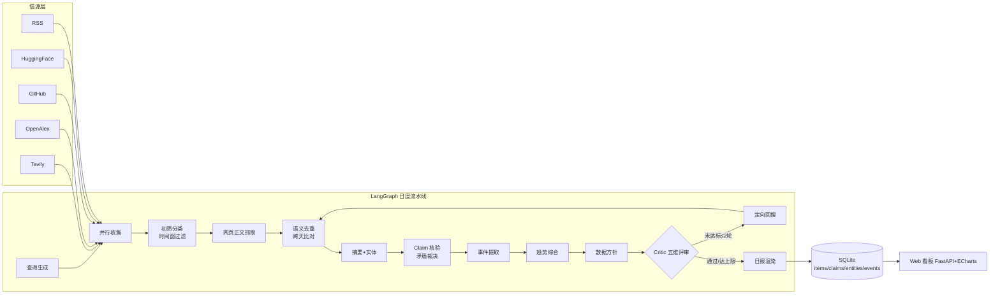

# 🐢 慢数据情报台 · SlowData Intel

<p align="center">
  <b>面向大模型数据团队的开源情报采集与「慢数据」沉淀系统</b><br>
  每天自动扫描 Benchmark / 竞品模型 / 人才流动 / 数据供应商动态，<br>
  产出带证据链的中文情报日报，并将全部线索沉淀为可检索、可追溯的数据资产。
</p>

<p align="center">
  <a href="https://slowdata-intel.onrender.com">🖥️ 在线看板（永久公开）</a> ·
  <a href="#快速开始">快速开始</a> ·
  <a href="#系统架构">架构</a> ·
  <a href="#部署">部署</a> ·
  <a href="docs/01-architecture.md">设计文档</a>
</p>

<p align="center">
  
  
  
  
  
</p>

---

## 这是什么

大模型数据团队的传统工作模式是：算法团队提需求 → 数据团队临时找供应商 → 响应滞后 2~3 周。
本系统把这项工作改造为**主动积累**：

```
每日情报流水线 ──► 结构化沉淀（条目/断言/实体/事件） ──► 可追溯趋势
                                                    │
                    算法提需 ──► 先在储备库检索 ──► 命中即有，响应小时级
```

每天 08:30 自动运行一次（约 7 分钟、LLM 成本约 $0.13），产出一份 Markdown 日报 + 增量写入本地 SQLite。

## 核心特性

- **五路信源并行采集**：Tavily 全网检索、OpenAlex 论文（覆盖 arXiv）、GitHub 开源社区、HuggingFace 模型生态、RSS 订阅池；LinkedIn / 公众号走合规的定向检索与 CSV 导入通道；
- **模型分层调用**：`deepseek-chat` 承担初筛、摘要、断言核验等大吞吐判断，`deepseek-reasoner` 只用于趋势综合、矛盾裁决、数据方针与 Critic 评审，本地 `Qwen3-Embedding` 零成本语义去重——单次运行成本约 $0.13；
- **信息正确性四道防线**：时间窗硬过滤（默认提需时间前 7 天）→ 网页正文抓取（含 JS 渲染兜底）→ Claim 级证据核验（✅/❌/❓ 逐断言搜证）→ Critic 五维评审与有界回搜回路；
- **慢数据沉淀**：条目、断言核验、实体字典、事件时间线四类资产入库，跨天语义去重，同一条新闻第二次出现自动标记"复现"；
- **可视化看板**：概览图表、Critic 五维雷达、日报目录阅读、条目即时检索、实体时间线、关注清单在线管理、成本追踪与手动触发。

## 系统架构



### 模型分层

| 层级 | 模型 | 承担节点 |
|------|------|----------|
| L0 无 LLM | 确定性代码 + 本地 Qwen3-Embedding-0.6B-Q | 收集、时间窗、抓取、去重、聚类、持久化 |
| L1 轻量 | `deepseek-chat`（JSON 模式） | 初筛、摘要、实体、断言拆解与判定、事件提取 |
| L2 推理 | `deepseek-reasoner` | 热点探测、矛盾裁决、趋势综合、数据方针、Critic |

> 经验法则：判断/抽取/筛选 → L1；综合/裁决/评审 → L2；能不用 LLM 就不用。
> 日预算默认 $0.5，超 60% 后 L2 节点自动降级 L1（报告中会标注）。

## 快速开始

```bash
git clone https://github.com/xty116/slowdata-intel.git
cd slowdata-intel

# 1. 配置密钥
cp .env.example .env   # 填入 DEEPSEEK_API_KEY / TAVILY_API_KEY / DASHBOARD_TOKEN

# 2. 安装依赖（Python 3.12，推荐 uv）
export UV_CACHE_DIR="$PWD/.uv-cache" UV_PYTHON_INSTALL_DIR="$PWD/.uv-python" \
       HF_HOME="$PWD/.hf-cache" FASTEMBED_CACHE_PATH="$PWD/.fastembed-cache"
uv venv --python 3.12 .venv && uv pip install --python .venv/bin/python -e .

# 3. 启动看板（含每日 08:30 定时运行；首次运行自动下载嵌入模型约 1.1GB）
./run.sh serve        # → http://127.0.0.1:8000

# 或手动跑一次流水线
./run.sh run
```

## Web 看板

| 页面 | 功能 |
|------|------|
| `/` 概览 | 库存指标卡、14 天成本趋势、Critic 五维雷达、信源分布环形图、一键触发运行 |
| `/reports` | 日报列表与在线阅读（悬浮目录导航、滚动高亮） |
| `/items` | 条目即时检索：关键词/信源/维度/重要度/核验状态筛选 + 分页 |
| `/entities` | 实体档案：类型筛选、事件活跃度时间线图、关联条目 |
| `/watchlist` | 关注清单在线增删（写回配置，下次运行生效） |
| `/runs` | 运行历史（节点级成本明细）+ 手动触发 + 实时进度 |

看板默认本地访问。**公网访问**：设置 `.env` 中的 `DASHBOARD_TOKEN` 后，用 cloudflared 隧道或 Render 部署（见[部署](#部署)）。

## 情报流水线（工作原理）

一次完整运行按序经过 13 个节点：

| 节点 | 模型 | 说明 |
|------|------|------|
| 查询生成 | L0+L2 | Watchlist 词表展开 + reasoner 生成"今日热点"补充 query |
| 并行收集 | L0 | 五路信源异步扇出；时间窗第一层过滤（Tavily days=7 / OpenAlex、GitHub 日期参数） |
| 初筛分类 | L1 | 相关性 + 四维度打标（benchmark/competitor/talent/supplier）+ 重要度 1~5 + 日期线索提取（第二层） |
| 正文抓取 | L0 | 重要度≥3 抓网页正文（表格转文本 + 内嵌 JSON + r.jina.ai JS 渲染兜底）；页面日期复核（第三层） |
| 语义去重 | L0 | 本地嵌入聚类 + 近 7 天存量向量比对，标记"复现/新" |
| 摘要+实体 | L1 | 簇摘要 + 类型化实体抽取（company/model/benchmark/dataset/person/supplier） |
| Claim 核验 | L1+L2 | 重要度≥4 簇拆原子断言 → 逐条搜证判 ✅/❌/❓ → 冲突时 reasoner 矛盾裁决（置信度） |
| 事件提取 | L1 | 归一化事件（发布/榜单动作/招聘/采买/供应商动作/融资）入事件时间线 |
| 趋势综合 | L2 | 四维度情报 + 风险与机会；✅直接引用、❓标注未证实、❌转述裁决 |
| 数据方针 | L2 | 可执行动作 + P0/P1/P2 优先级 + Watchlist 建议 |
| Critic 评审 | L2 | 事实性/完整性/引用可靠性/**时效性**/可操作性五维打分；任一 <7 触发定向回搜（≤2 轮） |
| 回搜 | L0+L1 | Critic 补充 query 定向检索，并入重去重、重综合 |
| 日报渲染 | L0 | Markdown 日报 + 运行统计（每节点成本） |

日报样例结构：情报正文（今日头条 Top5 + 四维度 + 风险机会）→ 数据方针（P0/P1/P2 表格）→ 证据核验与矛盾裁决 → 实体事件 → Critic 评分 → 线索附录（每条带信源/日期/核验标记）→ 运行统计。

## 质量保障机制

设计目标不是"每句话都对"，而是**错误可被检出、可被追溯、可被纠正**：

| 防线 | 机制 |
|------|------|
| 时间窗 | 检索参数 → 入库过滤 → 初筛日期线索 → 抓页复核，四层过滤；无日期条目标 ⏱️ 且不得作为唯一依据 |
| Claim 核验 | 断言级 ✅/❌/❓ 判定 + 证据链接（claims 表），非整条"看起来对就放行" |
| 矛盾裁决 | 信源冲突时 reasoner 权衡权威/时效/精确度，输出采信版本 + 置信度 |
| Critic 回路 | 五维打分 + 有界回搜（≤2 轮 + 预算上限）+ 降级接受标注 |
| 全链路溯源 | 每条结论 → 依据编号 → 附录 → URL + 信源 + 日期，人工可复核 |

## 数据资产（SQLite）

| 表 | 内容 |
|----|------|
| `items` | 全部条目（含嵌入向量、页面正文快照） |
| `claims` | 断言级核验记录（verdict + 证据链接） |
| `entities` | 实体字典（公司/模型/benchmark/数据集/人物/供应商） |
| `events` | 归一化事件时间线（慢数据的最小单元） |
| `item_entities` | 条目 ↔ 实体链接 |
| `runs` | 运行审计（状态/成本/token/节点明细/Critic 评分） |

命令行检查：`./run.sh stats`（运行历史）、`./run.sh db items|claims|entities|events`（查看数据）。

## 配置

| 文件 | 说明 |
|------|------|
| `config/config.yaml` | 预算、时间窗、核验强度、Critic 阈值、看板端口、定时时间 |
| `config/watchlist.yaml` | 关注主题与检索词（在线看板可增删） |
| `config/sources.yaml` | RSS 订阅源清单 |
| `config/prompts/*.md` | 10 个版本化 Prompt（初筛/摘要/综合/方针/核验/裁决/Critic/事件） |

关键旋钮：`sources.time_window_days`（时间窗，默认 7）、`verify.max_clusters`（核验成本）、`critic.min_score / max_rounds`（质量门槛与回搜上限）、`llm.daily_budget_usd`（日预算）。

## 部署

### Docker

```bash
docker build -t slowdata-intel .
docker run -d -p 8000:8000 \
  -e DEEPSEEK_API_KEY=... -e TAVILY_API_KEY=... -e DASHBOARD_TOKEN=... \
  -v slowdata-data:/data -e SLOWDATA_DATA_DIR=/data \
  slowdata-intel
```

### Render 一键部署（获得永久公网链接）

本仓库已部署于 Render（公开只读模式）：**https://slowdata-intel.onrender.com**

自己部署：

1. 打开 [render.com](https://render.com)，用 GitHub 账号登录；
2. **New → Blueprint** → 选择本仓库（自动读取 `render.yaml`）；
3. 填入两个密钥：`DEEPSEEK_API_KEY`、`TAVILY_API_KEY`（看板默认公开只读，无口令）；
4. 部署完成后获得 `https://xxx.onrender.com` 永久链接。

> Free 计划无月费，约 15 分钟无访问后休眠（下次访问冷启动 1~2 分钟）；Starter 计划（$7/月）常驻。
> 公开只读模式（`SLOWDATA_READONLY=1`）：所有访客可查看数据，但**不能触发运行、不能修改关注清单**；定时任务照常自动运行。
> 若要口令保护：设置环境变量 `DASHBOARD_TOKEN` 并移除/置空 `SLOWDATA_READONLY`。
> 云端 512MB 内存自动使用 `SLOWDATA_NO_EMBED=1`（标题相似度去重）；自建大内存实例可去掉该变量启用本地嵌入。

### 临时公网链接（免账号，演示用）

```bash
./run.sh serve   # 终端 A
./tools/cloudflared tunnel --url http://127.0.0.1:8000 --no-autoupdate   # 终端 B
# 输出 https://xxx.trycloudflare.com 即公网链接（重启后变化，依赖本机在线）
```

## 项目结构

```
slowdata-intel/
├── slowdata/
│   ├── llm.py             # DeepSeek 分层客户端（L1/L2 路由 + 用量计费 + 降级）
│   ├── graph.py           # LangGraph 日度流水线编排（Critic 条件回路）
│   ├── pipeline_nodes.py  # 13 个流水线节点实现
│   ├── sources/           # tavily / openalex / github / huggingface / rss 连接器
│   ├── pagetext.py        # 网页正文抓取（表格/内嵌JSON/JS渲染兜底）
│   ├── embeddings.py      # 本地 Qwen3-Embedding 语义去重
│   ├── store.py           # SQLite 六表沉淀层
│   ├── report.py          # Markdown 日报渲染
│   └── web/               # FastAPI 看板 + ECharts 前端（无构建链）
├── config/                # 配置与版本化 Prompt
├── docs/01-architecture.md
├── Dockerfile / render.yaml
└── run.sh                 # 一键入口（run / serve / stats / db / import-csv）
```

