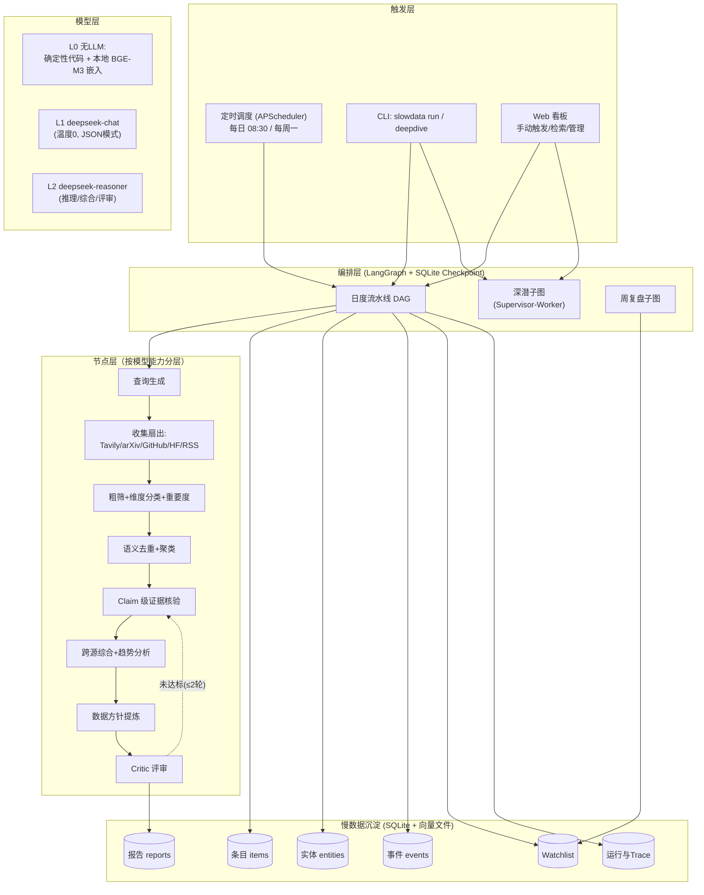

# 「慢数据」情报 Agent —— 系统设计方案 v1.0

> 面向大模型数据团队：主动感知 Benchmark / 竞品模型 / 人才流动 / 数据供应商动态，
> 沉淀为可检索、可追溯、可决策的"慢数据"资产，实现"算法提需前，数据已就绪"。

---

## 1. 背景与目标

### 1.1 要解决的问题

- **被动**：只在算法团队提需后才找数据 → 响应滞后 2~3 周；
- **分散**：Benchmark、竞品、人才、供应商信息散落在论文 / 公众号 / 开源社区 / 招聘网站；
- **无沉淀**：每次调研都是"一次性"，结论、证据、信源无法复用，趋势无法对比；
- **成本无控**：旧版系统全链路用最强模型（Gemini-3-Pro）一把梭，既贵又慢。

### 1.2 「慢数据」核心理念

把情报工作从"事件驱动的一次性调研"改造为"持续积累的资产"：

```
每日情报流水线 ──► 结构化沉淀（条目/实体/事件/证据） ──► 可追溯趋势
                                                          │
                          算法提需 ──► 先在储备库检索 ──► 命中率提升、响应小时级
```

### 1.3 相比旧版（简历中的 Supervisor-Worker 系统）的升级点

| # | 旧版 | 新版 | 升级理由 |
|---|------|------|----------|
| 1 | 全链路 Gemini-3-Pro 单一模型 | **三级模型分层 + 预算控制 + 自动降级** | 80% 的节点（分类/抽取/摘要/核验）用弱模型即可，成本降一个数量级 |
| 2 | 一次性日报，无长期记忆 | **实体库 + 事件时间线 + Watchlist 演化**，跨日语义去重、周环比趋势 | "慢数据"的核心是积累，不是每天重新调研一遍 |
| 3 | 纯动态 Supervisor 拆解 | **固定 DAG（日常）+ 动态深潜子图（on-demand）双模式** | 日常流水线成本可预测；探索性问题仍保留 Supervisor-Worker 灵活性 |
| 4 | Critic 未达标→回搜，无边界 | **Critic 打分门控 + 预算上限 + 最多 2 轮回搜 + 降级接受（带风险标注）** | 避免无限回搜烧钱；质量与成本可调 |
| 5 | 整条信息级核验 | **Claim 级证据核验 + 跨源矛盾裁决节点** | 弱模型逐条验证小判断，强模型只裁决冲突，分工更经济 |
| 6 | 依赖 LangSmith 等外部 Trace | **本地 Trace 库 + 周复盘 Agent（半自动迭代）** | 数据不出内网；Prompt 变更需人工确认，避免全自动改坏 |
| 7 | — | **全量成本/延迟可观测，每节点 Token 与美元计费** | 运行成本透明，路由策略可基于数据优化 |

---

## 2. 总体架构

### 2.1 架构图



### 2.2 双模式设计

| 模式 | 形态 | 触发 | 特点 |
|------|------|------|------|
| **日度流水线** | 固定 DAG，节点与边确定 | 定时 / 手动 | 成本可预测（LLM 预算 ≤$0.5/日），并行扇出，约 20 分钟完成 |
| **深潜模式** | Supervisor-Worker 动态子图 | 用户在 Web 输入问题 | Supervisor（reasoner）拆解问题 → 并行派发信源 Worker → 归约 → 综合 → Critic；复用日度流水线的全部节点 |
| **周复盘** | 固定 DAG + 元分析 | 每周一 | 读 Trace 与 Critic 历史 → 输出路由/Prompt 调整建议 → **人工确认后**应用 |

---

## 3. 日度流水线详解（核心）

### 3.1 阶段与数据流

```
① 查询生成 ──► ② 并行收集 ──► ③ 归一化 ──► ④ 粗筛+分类 ──► ⑤ 去重聚类 ──►
⑥ 摘要+实体抽取 ──► ⑦ Claim 核验 ──► ⑧ 趋势综合 ──► ⑨ 数据方针 ──►
⑩ Critic 评审（可能回搜≤2轮） ──► ⑪ 持久化 ──► ⑫ 报告/看板
```

| 阶段 | 做什么 | 模型层级 | 说明 |
|------|--------|----------|------|
| ① 查询生成 | 由 Watchlist + 昨日趋势 + 手动查询，生成 10~20 条检索 query（中英双语） | **L2**（低频率：直接查库，仅 watchlist 变化时才调 LLM） | 查询模板缓存，命中缓存则零 LLM 调用 |
| ② 并行收集 | Tavily 检索 + arXiv API + GitHub Trending/Search + HuggingFace API + RSS 订阅池 | **L0** | 全异步扇出；每源带超时/重试/限流 |
| ③ 归一化 + 正文抓取 | 统一 Item schema（标题/正文/URL/信源/发布时间/语言）；对重要度≥3 条目抓取网页正文：正文文本 + 表格转文本 + 内嵌 JSON（排行榜数据常藏于此）+ 页面日期 | **L0** | 页面日期用于时间窗复核、补全"时间未知"条目；正文喂给摘要层，解决"只看搜索摘要、漏掉页面内关键数据"的问题 |
| ④ 粗筛+分类 | 判断相关性（广告/无关丢弃）；打 4 维度标签（benchmark / competitor / talent / supplier，可多标签）；打重要度 1~5 | **L1** | JSON 模式，批量处理，每条 ~300 token |
| ⑤ 去重聚类 | 当日内：URL/hash 精确去重 → BGE-M3 嵌入 → 余弦相似度连通分量聚类；跨日：与近 30 天存量条目比对，标记"复现/新进展" | **L0** | 纯向量计算；10 万级条目暴力检索毫秒级 |
| ⑥ 摘要+实体抽取 | 每簇生成代表摘要；抽取实体（公司/模型/Benchmark/数据集/人物，含类型）链接到实体库 | **L1** | 实体入库并建立 item↔entity 链接 |
| ⑥.5 Claim 核验 | 重要度≥4 簇：L1 拆解 2~3 条原子断言 → 每条定向检索（basic，days=7）→ L1 判定 支持/矛盾/未证实 → 证据与断言入 claims 表 | **L1** | 断言级证据链，非整条核验 |
| ⑥.6 矛盾裁决 | 存在冲突/未证实断言的簇：权衡信源权威性/时效/表述精确度，输出采信版本+置信度 | **L2** | 裁决结果写回簇，综合层禁止传播被否结论 |
| ⑥.7 事件提取 | 从摘要提取归一化事件（类型：发布/榜单动作/招聘/采买/供应商动作/融资）入 events 表，链接实体 | **L1** | 慢数据时间线的最小单元 |
| ⑦ 趋势综合 | 输入：聚类后条目 + 断言核验标记 + 裁决 + 事件时间线 + 上周对比 → 输出四维度趋势、竞品动作、供应商动作、人才信号、新增风险 | **L2** | 核验纪律：✅可直接引用、❓标注未证实、❌必须转述裁决 |
| ⑧ 数据方针 | 由趋势翻译为可执行动作：新增 Watchlist 查询、建议储备的数据方向（映射到 benchmark 需求）、采买优先级、风险提示 | **L2** | 输出结构化 JSON，规则引擎自动落 Watchlist（标记"系统生成，待人工确认"） |
| ⑧.5 Critic 评审 | 五维打分（事实性/完整性/引用可靠性/**时效性**/可操作性，各 0~10）→ 未达标维度生成定向补充 query → 回搜 → 重去重/重综合（≤2 轮）→ 仍不达标则降级接受并在报告标注风险 | **L2** | 时效性维度检查：结论依据是否全部在提需时间前一周内、是否误用时间未知条目 |
| ⑪ 持久化 | 全部条目/实体/事件/claims/report/trace 落库 | **L0** | SQLite WAL 模式 |
| ⑫ 输出 | Markdown 日报 + 看板数据 | **L0/L1**（排版润色用 L1） | 报告与库同源，永不失配 |

### 3.2 Critic 评审与自动回搜回路

```
Critic(打分) ──► 全部维度 ≥ 7 ? ──► 通过
                        │否
                        ▼
             定位最弱维度 → 生成 3~5 条定向 query → 回搜 → 增量合并
                        │
                        ▼  (最多 2 轮，回搜预算用尽则终止)
              重综合 → 重新打分 → 通过 or 接受+风险标注
```

---

## 4. 模型分层方案（本设计的核心决策）

### 4.1 三级能力分层

| 层级 | 载体 | 适用任务特征 | 成本定位 |
|------|------|--------------|----------|
| **L0 无 LLM** | 确定性代码 + 本地 BGE-M3（fastembed/ONNX） | 检索、抓取、hash 去重、向量相似度、聚类、存储 | 零 API 成本 |
| **L1 弱模型** | `deepseek-chat`（temperature 0，JSON 模式，开 KV 缓存） | 大吞吐、模式固定、答案空间有限的判断类任务 | 输入 $0.28/M（缓存命中 $0.028/M），输出 $0.42/M（以官方最新价为准） |
| **L2 强模型** | `deepseek-reasoner` | 需要多步推理、长上下文综合、战略判断 | 输出 $2.19/M，贵约 5 倍 → 只给 4~5 个关键节点 |

### 4.2 节点 ↔ 模型路由表（完整）

| 节点 | 层级 | 依据 |
|------|------|------|
| 查询生成（缓存未命中时） | **L2** | 探索性：需要把"意图"翻译成高质量检索式；命中缓存则 L0 |
| 信源连接器（Tavily/arXiv/GitHub/HF/RSS） | **L0** | 纯 API 调用，零 LLM |
| 粗筛（相关性/广告过滤） | **L1** | 二元/三元判断，大吞吐 |
| 维度分类 + 重要度打分 | **L1** | 封闭集合分类 + 1~5 打分，JSON 模式稳定 |
| 语义去重 / 聚类 / 簇代表选择 | **L0** | 向量相似度即可，无需语义理解 |
| 簇标题与代表摘要 | **L1** | 抽取式为主，低难度 |
| 实体抽取与归一 | **L1** | 模式化 NER，别名表兜底 |
| Claim 拆解 | **L1** | 每条条目拆 2~5 个断言，模板化 |
| Claim 逐条核验（支持/矛盾/未证实） | **L1** | 大量独立小判断，宽进严出 |
| **跨源矛盾裁决** | **L2** | 需要权衡信源权威性、时间、表述差异，真实推理 |
| **趋势综合** | **L2** | 长上下文（当天全部簇 + 历史时间线）+ 归纳推理，日报质量天花板 |
| **数据方针提炼** | **L2** | 战略推理，直接决定采买动作，值得用最强模型 |
| **Critic 评审** | **L2** | 评审能力必须高于生成能力，否则抓不出错 |
| 日报排版润色 | **L1** | 结构化数据 → Markdown 模板化，弱模型足够 |
| 周复盘（元分析） | **L2** | 读 Trace 找 badcase 模式，需要推理 |
| 深潜模式 Supervisor | **L2** | 任务拆解是动态规划问题 |
| 深潜模式 Worker（搜索执行） | **L0/L1** | 复用日度节点 |

> **经验法则**：判断/抽取/筛选类 → L1；综合/裁决/评审/规划类 → L2；能不用 LLM 就不用。

### 4.3 预算控制与降级策略

- **默认日预算**：LLM $0.50 / 日，Tavily 50 次 / 日（配置可调）；
- **逐节点用量追踪**：每个节点记录 prompt/completion tokens 与估算美元；
- **降级链**：预算耗尽或 reasoner 限流时，`L2 → L1` 自动降级（报告标注"本节点已降级"）；
- **KV 缓存优化**：所有 L1/L2 的 system prompt 固定且前置，命中 DeepSeek 上下文缓存，大吞吐节点输入成本可降至 1/10；
- **并发控制**：asyncio 信号量 + 指数退避重试，尊重官方限流。

---

## 5. 信源体系（500+ 信源的落地方式）

### 5.1 信源分层

| 层 | 信源 | 接入方式 | 状态 |
|----|------|----------|------|
| 主动检索 | Tavily（备选 Bocha） | API，每日 10~20 组 query × 双语，`days=7` 时间窗参数 | ✅ 已实现 |
| 学术 | OpenAlex 论文 API（LLM benchmark/evaluation/dataset 短语 + AI 概念过滤，按出版日期时间窗） | REST API，免费 | ✅ 已实现（arXiv 官方 API 按 TLS 指纹拦截 Python 客户端，OpenAlex 覆盖含 arXiv 的全学科论文） |
| 开源社区 | GitHub Search API（eval harness、dataset、benchmark 相关 repo，按创建时间窗过滤） | REST API | ✅ 已实现 |
| 模型生态 | HuggingFace：每日论文（daily_papers）+ 趋势数据集（trending） | REST API | ✅ 已实现 |
| 定向订阅 | RSS 池：机器之心 / 量子位 / 新智元 / InfoQ AI / HackerNews / 供应商官方博客 | feedparser，可配 RSSHub 自建源 | M2 |
| 人才信号 | LinkedIn 无合规 API → Tavily `site:linkedin.com` 定向检索 + **手动 CSV 导入通道**（`slowdata import-csv`） | 导入 + 检索 | ✅ 已实现 |
| 公众号 | Tavily `site:mp.weixin.qq.com` 定向检索（合规，不爬私有接口） | 检索 | ✅ 已实现 |

### 5.2 合规红线

- 不爬取公众号/LinkedIn 私有接口；公众号走 Tavily `site:` 公开检索，LinkedIn 走人工 CSV 导入；
- 所有条目保留原始 URL 与抓取时间戳，报告全部标注信源；
- 信源清单 YAML 化（`config/sources.yaml` → `config/config.yaml` sources 段），可增删、可设优先级与抓取频率。

### 5.3 时间窗策略（默认：提需时间前一周）

> 需求：prompt 有明确时间要求时按 prompt 执行；否则**所有资料一律限定在提需时间前一周（默认 7 天，可配置 `sources.time_window_days`）内**。

- **检索层**：Tavily 传 `days=7`；arXiv 按提交时间倒序；GitHub 按 `created:>窗口起点` 过滤；
- **入库层**：带明确日期的条目超窗直接丢弃（含早于窗口与未来日期）；
- **抓页层**：对"时间未知"条目抓取网页，提取页面日期（meta/article 发布时间）复核：证实超窗 → 丢弃；证实窗内 → 补全日期；
- **兜底**：仍无日期的条目标记"⏱️时间未知"并降权（初筛时 importance 上限 4），报告附录显式标注，**不得作为任何结论的唯一依据**（`undated_policy: keep_flagged`，可改 `drop` 全丢弃）；
- **Critic 打分**：五维评分中的"时效性"维度专门检查——结论依据是否全部落在时间窗内、是否误把时间未知条目当作唯一证据。

---

## 6. 慢数据沉淀：数据模型

### 6.1 SQLite Schema（核心表）

| 表 | 关键字段 | 作用 |
|----|----------|------|
| `items` | id, url_hash, title, content, source_id, published_at, fetched_at, lang, dimensions[], importance, quality_score, cluster_id, is_new, status | 原始条目，全生命周期 |
| `entities` | id, type(company/model/benchmark/dataset/person/supplier), name, aliases[], first_seen, last_seen | 实体字典（别名归一的锚点） |
| `item_entities` | item_id, entity_id, role | 条目↔实体多对多 |
| `events` | id, entity_id, event_type(benchmark_release/model_release/hiring/data_purchase/supplier_move/...), summary, evidence_item_ids[], happened_at, confidence | 归一化事件，趋势对比的最小单元 |
| `claims` | id, run_id, item_url_hash, claim_text, verdict(support/contradict/unverified), reason, evidence_json[], verdict_at | 断言级证据链 ✅ M2 |
| `entities` | id, type(company/model/benchmark/dataset/person/supplier), name(UNIQUE), first_seen, last_seen | 实体字典 ✅ M2 |
| `item_entities` | item_id, entity_id | 条目↔实体多对多 ✅ M2 |
| `events` | id, run_id, entity_id, event_type(benchmark_release/model_release/hiring/data_purchase/supplier_move/funding/org_news/...), summary, evidence_json[], happened_at, confidence | 归一化事件 ✅ M2 |
| `watchlist` | id, query, dimensions[], priority, status, origin(human/generated), last_hit_at | 关注清单，随趋势演化 |
| `reports` | id, report_date, type(daily/weekly), markdown_path, summary_json, critic_scores | 报告产物 |
| `runs` | id, mode, started_at, finished_at, status, cost_usd, tokens, stage_stats | 运行审计 |
| `traces` | run_id, node, model_tier, prompt_version, input_hash, tokens, latency_ms, error | badcase 归因原料 |
| `embeddings` | item_id, vec_blob(float32), model, dim | 向量（近 30 天） |

> 向量检索：10 万级以内用 NumPy 暴力余弦（毫秒级），无需向量数据库，零额外依赖；超过 10 万再迁 sqlite-vec / Qdrant（预留接口）。

### 6.2 跨日去重与"新进展"识别

- 每日条目与近 30 天存量比对（余弦 ≥ 0.90 视为同事件）；
- 命中旧簇 → 标记 `is_new=false`，更新"复现次数"，若内容有实质增量则生成 `event` 追加时间线；
- 报告中的"本周新动态" = 本周事件时间线 diff，规则引擎直接算出，无需 LLM。

---

## 7. 输出：日报与 Web 看板

### 7.1 Markdown 日报结构

1. **今日头条 Top 5**（最高重要度信号，一句话 + 证据链接）
2. **Benchmark 动态**（新 benchmark、榜单变化、热度上升信号）
3. **竞品模型动态**（发布、榜单动作、技术路线变化）
4. **人才信号**（关键招聘/流动 + 用途推断，标注推断置信度）
5. **供应商与数据动态**（数据采买线索、供应商业务变化）
6. **周环比**（与上周对比：新增/变化/消失的信号）
7. **数据方针建议**（建议储备的数据方向 → 对应 benchmark、优先级、供应商线索）
8. **Watchlist 建议**（新增/降权/移除，系统生成待确认）
9. **附录**：全部条目表（信源、URL、重要度、核验状态）

### 7.2 Web 看板页面（FastAPI + 原生 HTML/JS，无前端构建链）

| 页面 | 内容 |
|------|------|
| `/` 概览 | 最近报告摘要、运行状态、本月成本、信源健康度 |
| `/reports/{date}` | 渲染日报/周报 |
| `/items` | 条目检索：维度/实体/时间/重要度/核验状态过滤 |
| `/entities/{id}` | 实体档案：时间线、关联条目、事件序列 |
| `/watchlist` | 增删改查 + 确认"系统生成"条目 |
| `/runs` | 运行历史：每节点耗时/token/成本 + Trace 查看 |
| `/deepdive` | 输入问题 → 触发深潜模式，轮询结果 |

### 7.3 调度

- `slowdata serve`：FastAPI + APScheduler（每日 08:30 日度流水线，每周一 09:00 周报 + 复盘）；
- `slowdata run [--date]`：手动跑一次；
- 运行幂等：同一天重跑 = 增量更新（旧条目标记 superseded），不产生重复数据。

---

## 8. 可观测性与迭代闭环

1. **逐节点 Trace**：节点名、模型层级、Prompt 版本、token、延迟、错误，全部落 `traces` 表；
2. **成本看板**：按天/按节点聚合美元成本，路由决策有数据支撑；
3. **周复盘 Agent**（每周一）：
   - 输入：本周 Critic 低分报告 + 失败 Trace + 误判条目样本；
   - 输出：Prompt 修改建议 / 路由调整建议 / 信源增减建议（**人工确认后应用**）；
   - Prompt 版本化于 `config/prompts/*.md`（带版本头），变更可回滚、可归因；
4. **信源健康度**：每源统计命中率/平均重要度/失效次数，周复盘自动建议降权。

---

## 9. 技术栈与目录结构

### 9.1 技术栈

- **编排**：LangGraph（DAG + Send 扇出 + SqliteSaver 断点续跑）
- **LLM**：DeepSeek 官方 API（openai 兼容 SDK，异步 + 限流重试）
- **Embedding**：本地 BGE-M3（fastembed/ONNX，CPU 即可）
- **存储**：SQLite（WAL）+ NumPy 向量文件
- **采集**：httpx + feedparser + arXiv/GitHub/HF REST
- **Web**：FastAPI + uvicorn + APScheduler + 原生模板
- **运行环境**：Python 3.11+，macOS 可直接跑

### 9.2 目录结构

```
数据agent/
├── docs/
│   ├── 01-architecture.md        # 本设计文档
│   ├── 02-model-tiering.md       # 模型分层与预算细则
│   └── 03-data-model.md          # SQLite 建表与字段字典
├── pyproject.toml
├── .env.example                  # DEEPSEEK_API_KEY / TAVILY_API_KEY
├── config/
│   ├── config.yaml               # 预算、调度、阈值、模型映射
│   ├── sources.yaml              # 信源清单（RSS/API）
│   ├── watchlist.seed.yaml       # 初始关注清单
│   └── prompts/                  # 版本化 Prompt（v1_critic.md ...）
├── slowdata/
│   ├── llm/          # DeepSeek 客户端封装、分层路由、用量追踪、降级
│   ├── embeddings/   # BGE-M3 封装、向量存取
│   ├── sources/      # tavily/arxiv/github/hf/rss 连接器 + 归一化
│   ├── graph/
│   │   ├── daily_graph.py        # 日度 DAG
│   │   ├── deepdive_graph.py     # 深潜 Supervisor-Worker
│   │   ├── weekly_graph.py       # 周复盘
│   │   └── nodes/                # 各阶段节点实现
│   ├── store/        # sqlite、实体、事件、去重、claims
│   ├── report/       # Markdown 渲染
│   ├── web/          # FastAPI 看板
│   └── cli.py
└── tests/
```

---

## 10. 实施里程碑（确认设计后按序执行）

| 里程碑 | 内容 | 状态 |
|--------|------|------|
| **M1 骨架** | LLM 层 + 存储层 + Tavily + 单条流水线 + 日报 CLI | ✅ 完成 |
| **M2 全量能力** | 多信源（Tavily/OpenAlex/GitHub/HF/RSS + LinkedIn/公众号合规通道）、网页正文抓取（含 JS 渲染兜底）、时间窗硬约束、Claim 核验、矛盾裁决、Critic 回路、实体/事件沉淀 | ✅ 完成 |
| **M3 看板与调度** | FastAPI 看板（概览/日报/条目/实体/关注清单/运行历史+手动触发）+ APScheduler 每日 08:30 定时 | ✅ 完成 |
| **M4 深潜与迭代** | 深潜模式、周复盘半自动迭代、Watchlist 演化闭环、信源健康度 | 待开工 |

---

## 11. 风险与对策

| 风险 | 对策 |
|------|------|
| DeepSeek 官方 API 限流（无 Batch API） | 异步信号量 + 指数退避；L2 节点少而精；KV 缓存压低输入成本 |
| reasoner 不支持严格 JSON | L2 节点输出 Markdown 结构化 + 鲁棒解析，JSON 严格模式只给 L1 |
| LinkedIn/公众号不可程序化获取 | 手动 CSV 导入通道 + RSSHub 公开源 + Tavily 检索兜底（合规优先） |
| 语义去重误合并（不同事件高相似） | 阈值保守（0.90）+ 簇内时间窗校验 + 关键实体必须一致 |
| 自动回搜烧钱 | Critic 回搜预算上限 + 轮次上限 + 最终降级接受机制 |
| 日报"AI 味"重、不可执行 | 数据方针节点强制输出"动作+对象+优先级+依据"，模板约束 |

---

## 12. 需要你提供的

1. `DEEPSEEK_API_KEY`、`TAVILY_API_KEY`（写入本地 `.env`，不进库）；
2. 初始 Watchlist：你们当前重点关注的 benchmark / 竞品公司 / 供应商（我来生成 seed 版本，你可以增删）；
3. 如果公司已有内部信源（如内网数据集清单），告诉我格式，我加导入通道。

---

*确认本方案后，我将按 M1 → M4 顺序开始实现。*
